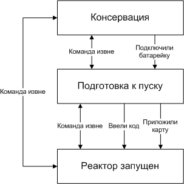

# Щиток

🔴 **Внимание!!!** Считыватель/клавиатура на щитке являются автономным устройством, не управляются как таковые с сервера данжа. Перед игрой необходимо прописать нужные карточки/коды на устройстве вручную. Инструкция приложена внизу страницы.

[Repository](https://github.com/skaben/simple_shield)

### Предназначение:

Моделирование процесса запуска реактора данжона и вывода из консервации. 

### Процесс игрового взаимодействия:

1. Для того, чтобы активировать кодовую клавиатуру (она же считыватель смарт-карт) необходимо найти, принести и подключить с соблюдением полярности маленькую батареечку. После этого щиток изобразит визуально и аудиально запуск и подаст питание на клавиатуру. [В этот момент сервер базы должен сменить статус с синего на голубой](./alert_status.md).
2. После этого, для завершения процесса запуска, игроки должны приложить к клавиатуре правильную карточку или ввести нужный код, после чего щиток выдаст ещё одну техническую демонстрацию. [Сервер в этот момент должен сменить статус на зелёный.](./alert_status.md)

---

### Концептуальная схема работы, автомат состояний:

### Инструкция к считывателю/клавиатуре

[Инструкция K2000 (PDF)](../.assets/K2000.pdf)